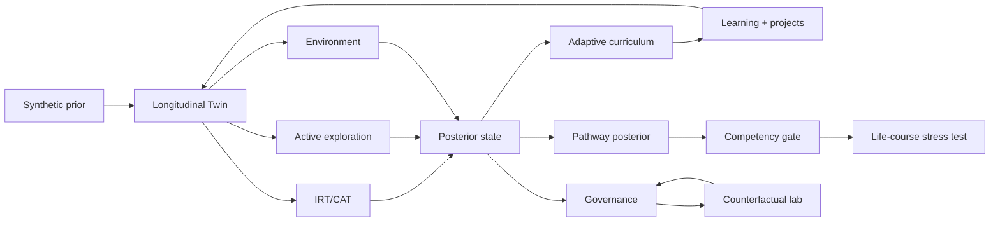

# Architecture

Digital Twin is a simulation laboratory, not a production decision system.

## Decision order

1. update environment
2. update capability state
3. conduct adaptive assessments
4. update uncertainty
5. choose information-rich exploration
6. update from exploration evidence
7. calculate pathway posterior
8. select curriculum
9. apply learning and forgetting
10. evaluate wellbeing
11. write audit record
12. check competency gate

The recommendation engine returns a posterior distribution and safety flags rather than deleting alternatives.
